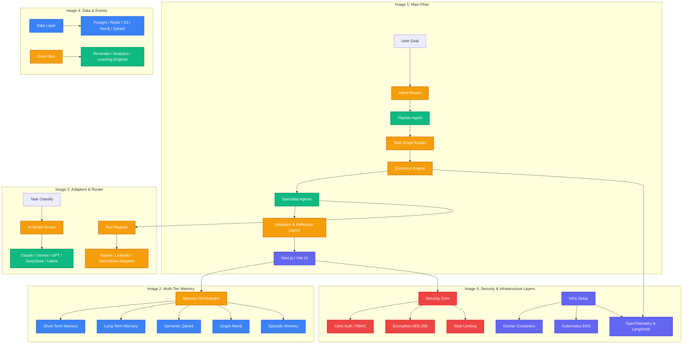

# 🌌 AgentForge Career OS: Architectural Analysis & Implementation Blueprint

An in-depth exploration of the AgentForge Career OS multi-agent architecture. This document maps your **6 high-fidelity architecture diagrams** to the actual codebase, details existing implementations, highlights core engineering gaps, and sets out a clear, phased blueprint for bridging them.

---

## 🗺️ Architectural Mapping

Here is how the diagrams you provided align with the current directory structure and file system of **AgentForge Career OS**:

```
c:\agent-forge-care\
├── docs/                             # Architecture specs and product vision
│   ├── product-vision.md             # Core multi-agent vision
│   └── status.md                     # Current codebase status & gaps (~78% complete)
├── backend/app/
│   ├── agents/
│   │   ├── graph.py                  # [IMAGE 1] Main LangGraph state orchestrator
│   │   ├── planner.py                # [IMAGE 1] Goal decomposition
│   │   ├── research_agent.py         # [IMAGE 3] Crunchbase / static adapters
│   │   └── assistant_agent.py        # [IMAGE 1] Resume, cover letter, interview, networking
│   ├── memory/
│   │   ├── memory_layer.py           # [IMAGE 2] Unified Memory Orchestrator
│   │   └── qdrant_client.py          # [IMAGE 4] Semantic Vector DB client
│   ├── api/
│   │   └── main.py                   # API Gateway entry point
│   ├── middleware/
│   │   └── auth.py                   # [IMAGE 6] Request logs and JWT/RBAC middleware
│   ├── models/                       # [IMAGE 4] SQLAlchemy DB schemas (PostgreSQL)
│   └── services/                     # [IMAGE 3] Matching & Reranking services
├── docker-compose.yml                # [IMAGE 6] Local multi-container Docker setup
└── src/ (Vite + React + TS)          # [IMAGE 1, 6] Core Frontend and page layers
    ├── pages/
    │   ├── Onboarding.tsx            # [IMAGE 5] Onboarding flow
    │   ├── Dashboard.tsx             # [IMAGE 5] Command Center and active task monitor
    │   ├── Opportunities.tsx         # [IMAGE 5] Discover opportunities
    │   ├── ResearchCenter.tsx        # [IMAGE 5] Company intelligence
    │   └── InterviewPrep.tsx         # [IMAGE 5] AI mock interview studio
```

---

## 🛠️ Architectural Systems Overview



---

### 📊 Image 1: Main Flow & Orchestration (LangGraph Engine)

This diagram establishes the **Planner-First Multi-Agent Loop** that acts as the command center for the Career OS:

* **Decomposition & Intent Routing**: The user's prompt is processed by the `Intent Router` and parsed by the `Planner Agent`, which translates high-level ambition (e.g., *"Help me secure a React internship in Bangalore"*) into discrete, actionable subtasks.
* **The Execution Loop**: The `Task Graph Builder` compiles these tasks into a dependency graph executed by the `Execution Engine`. The execution engine fires specialist agents (`Internships`, `Jobs`, `Resume`, `Research`, `Cover Letter`, `Interview Prep`, `Networking`, `Monitor`) in parallel.
* **Validation & Reflection**: Output from these specialists passes through a `Validation Layer` and a `Reflection Layer` (which score accuracy, specificity, and tone match) before formatting by the `Response Synthesizer` and returning to the frontend.

#### 🔗 Codebase Mapping & Implementation Status

* **LangGraph Orchestrator**: The exact state-machine defined in your diagram is implemented in [graph.py](file:///c:/agent-forge-care/backend/app/agents/graph.py). It uses a compiled `StateGraph` with three core nodes:
    1. `decompose_goal_node` (Planner LLM decomposes high-level goals into a serialized JSON task list).
    2. `dispatch_all_agents_node` (Runs specialists in parallel using `asyncio.gather()` over individual database sessions to avoid threading/session sharing conflicts).
    3. `generate_final_response_node` (Invokes [planner.py](file:///c:/agent-forge-care/backend/app/agents/planner.py) to synthesize output and updates database status to `completed`).
* **The Specialist Agents**: Handlers are linked to a standard dispatch map `AGENT_HANDLERS` in `graph.py` which executes specific async functions:
  * `discover_internships()` ([internship_agent.py](file:///c:/agent-forge-care/backend/app/agents/internship_agent.py))
  * `discover_jobs()` ([job_agent.py](file:///c:/agent-forge-care/backend/app/agents/job_agent.py))
  * `conduct_research()` ([research_agent.py](file:///c:/agent-forge-care/backend/app/agents/research_agent.py))
  * `tailor_resume()`, `generate_cover_letter()`, `prepare_interview()`, `generate_outreach()`, `run_daily_scan()`, `get_career_guidance()` ([assistant_agent.py](file:///c:/agent-forge-care/backend/app/agents/assistant_agent.py))

#### ⚠️ Gaps & Refinements

* The **Validation & Reflection Layer** has a structured rubric in `CLAUDE.md` (scoring Accuracy, Specificity, Actionability, Tone, and Format on a 0-10 scale), but this logic is currently stubbed out in `graph.py`. The execution loop executes agents and immediately passes output to `generate_final_response` without re-triggering the reflection loop if scores fall below the threshold (<35/50).

---

### 🧠 Image 2: Multi-Tier Memory Model

This diagram outlines a highly sophisticated **Multi-Tier Memory Orchestrator** designed to prevent the typical LLM "context fatigue" by organizing memory into specific, specialized tiers:

* **Short-Term / Working Memory**: Tracks immediate session-based context (current active conversations, user focus, temporary execution states).
* **Semantic Memory (Qdrant)**: Stores deep vector-based embeddings of user experiences, career summaries, and opportunities to match similar concepts.
* **Episodic Memory**: Holds historical events (past applications, mock interview scores, historical resume variants, and direct feedback from rejections/offers).
* **Graph Memory (Neo4j)**: Establishes a career knowledge graph representing structural connections between **Users, Skills, Companies, Projects, and Career Goals** (e.g., *User A knows Python -> Python is required by Company B -> Company B has SWE Intern role*).

#### 🔗 Codebase Mapping & Implementation Status

* **Qdrant & Postgres Hybrid**: Implemented in [memory_layer.py](file:///c:/agent-forge-care/backend/app/memory/memory_layer.py). It manages two primary collections in Qdrant:
    1. `memory_notes` (captures semantic memory from user feedback/profile).
    2. `opportunity_embeddings` (stores semantic representation of scraped jobs).
* **Two-Stage Blended Reranking**: To guarantee premium match scores, `memory_layer.py` implements a hybrid scoring system:
    1. *Stage 1*: Fast recall from Qdrant using cosine similarity.
    2. *Stage 2*: Re-scoring with the **Cohere Reranker** (`get_reranker()`) using a blending formula that weighs semantic overlap alongside explicit metadata constraints (e.g., location, skills match).

#### ⚠️ Gaps & Refinements

* **Neo4j Graph Memory**: The current database layer relies strictly on PostgreSQL and Qdrant. The graph nodes and edges (`User`, `Skills`, `Companies`, `Applications`) represented in the Neo4j diagram are not yet integrated into the active services. Neo4j graph connectors need to be established to power relational insights (e.g., mapping similar alumni paths or identifying skill dependencies).

---

### 🔌 Image 3: Tool Registry & Multi-Model Router

This diagram details the integration interfaces that connect the AI brain to the real world:

* **Task Classification**: Classifies incoming tasks as `Simple` (fast execution, minimal token cost) or `Complex` (intensive reasoning, deep context required).
* **The Model Router**: Intelligently routes tasks to optimize costs and performance:
  * *Simple Task Routing*: Sent to **Qwen** (cost-optimized summaries) or **Gemini Flash** (lightning-fast, large-context retrieval).
  * *Complex Task Routing*: Sent to **Claude 3.5 Sonnet** (deep company research, resume tailoring, career coaching) or **GPT-4o** (planning and multi-step orchestration).
  * *Self-Hosted Fallback*: Backed by a local **Llama** model for private or network-isolated queries.
* **The Tool Registry**: An abstraction layer mapping agent actions to web scrapers and external data adapters (LinkedIn, Naukri, Wellfound, Internshala, Unstop, Devfolio, GitHub, and Web Search).

#### 🔗 Codebase Mapping & Implementation Status

* **Model Cost Configuration**: The cost-management rules and token limits mapping directly to this diagram are detailed in `CLAUDE.md`.
* **Unified Search Adapters**: Scraper adapters are defined as stubs in the search service. The system gracefully falls back to generating rich synthetic data if an external API key is missing or fails.

#### ⚠️ Gaps & Refinements

* **Active Web Scrapers**: The `LinkedIn`, `Naukri`, `Wellfound`, and `Internshala` adapters require live integration (either via official APIs, proxy scrapers like Apify, or lightweight HTTP clients). Currently, these return static mock databases which limits live discovery.

---

### 💾 Image 4: Unified Data Layer & Async Event Bus

This diagram focuses on infrastructure scaling, data persistence, and async communication:

* **The Data Layer**: Combines multi-model databases:
  * *Neo4j*: Career graphs and relationship webs.
  * *PostgreSQL*: Structured transactional data (User profiles, specific applications, saved opportunities).
  * *S3 Storage*: Hard documents (Original and tailored resumes, cover letters, pdf reports).
  * *Qdrant*: High-dimensional vector embeddings.
  * *Redis*: Session stores, caching, and task queues.
* **The Event Bus (Kafka / NATS)**: Powers an event-driven loop that fires background workers in response to core system events:
  * `SkillAdded` -> Updates user profile and recalculates all opportunity match scores.
  * `InterviewScheduled` -> Fires the **Reminder Engine** to ping the user.
  * `OfferReceived` -> Directs the **Learning Engine** to analyze which resume bullet points and skills successfully generated the offer.
  * `ResumeUploaded` -> Triggers the **Analytics Engine** to calculate baseline ATS scores.
  * `ApplicationSubmitted` -> Triggers the **Notification Engine** to set follow-up tasks.

#### 🔗 Codebase Mapping & Implementation Status

* **SQLAlchemy Core**: PostgreSQL schemas are fully defined in `backend/app/models/user.py`. It includes relationships for `UserProfile`, `Skill`, `Opportunity`, `Application`, `AgentTask`, and `PlannerGoal`.
* **Redis Caching**: Redis integration is configured inside the backend dependencies, but currently handles simple endpoint caching.

#### ⚠️ Gaps & Refinements

* **Kafka Event Bus**: Currently, all events are processed synchronously inside the API route thread. A microservice event-bus layer (Kafka/NATS) is required to prevent heavy background calculations (such as batch matching or resume parsing) from blocking the HTTP event loop.
* **S3 Document Storage**: Tailored resumes are stored directly in PostgreSQL as text objects or local temp files. A clean S3/MinIO bucket service should be integrated for production asset management.

---

### 🗺️ Image 5: End-to-End User Flow

This diagram presents the sequential user journey that the system automates:

```
[Onboarding] -> [Goal Stated] -> [Planner Decomposes] -> [Opportunities Scraped & Ranked] -> [Research Compiles Info] -> [Resume & Cover Letter Tailored] -> [Human Approval Gate] -> [Pipeline Tracking] -> [AI Interview Mock Prep] -> [Offer Management] -> [Career Growth Analytics]
```

#### 🔗 Codebase Mapping & Implementation Status

* This flow is beautifully matched by the frontend page library inside `src/pages/`:
  * *Onboarding & Goal*: Managed by `Onboarding.tsx`, which collects profile details and target goals.
  * *Opportunities Feed*: Powered by `Opportunities.tsx` showing matching roles sorted by match score.
  * *Tailoring & Assets*: `ResumeStudio.tsx` allows editing resumes and drafting cover letters.
  * *Human Gate & Tracking*: `Applications.tsx` provides a sleek Kanban pipeline with columns matching your workflow.
  * *Interview Studio*: `InterviewPrep.tsx` provides mock questions and category stats.
  * *Analytics*: `Analytics.tsx` tracks application success metrics, weekly activity, and skills in demand.

#### ⚠️ Gaps & Refinements

* **Authentication Integration**: Although `Login.tsx` and `Register.tsx` are fully built on the frontend, they are not connected to the backend auth routes. Users currently operate on a static hardcoded user ID. Securing routes behind a real JWT middleware is the immediate next step.

---

### 🛡️ Image 6: Security & Infrastructure Layers

This newly provided diagram maps out the vital operational core of the platform, split into **Enterprise Security Controls** and a scalable **Cloud Infrastructure Engine**:

#### 🔒 Security Elements

* **Authentication & Authorization (Clerk / RBAC)**: Decoupled identity verification backed by token-based Role-Based Access Control (Viewer, User, Power User, Admin).
* **AES-256 Encryption & Secrets Management**: Encryption at rest for PII data (raw resumes, transcripts) paired with secure secret injection.
* **Audit Logging**: Immutable transactional tracing tracking every system action and agent execution.
* **GDPR Readiness**: Clear personal data deletion controls and compliance bounds.
* **Rate Limiting**: Throttling algorithms protecting backend processors from API spam.

#### 🏗️ Infrastructure Elements

* **Docker & Kubernetes (EKS)**: High-availability scaling leveraging containerization for fast, isolated service replicas.
* **Polyglot Storage & DBs**: PostgreSQL (relational user records), Redis (fast key-value cache), Qdrant (high-dimensional embeddings), S3 (pdf/resume binary buckets), and Neo4j (career graph relationships).
* **Advanced Monitoring**: Tracing and profiling backed by **LangSmith** (prompt tracing), **Grafana** (system performance), and **OpenTelemetry** (distributed cross-service spans).
* **Hosting Pipelines**: Structured deploy bounds routing the FastAPI backend and Vercel-hosted Vite frontend.

#### 🔗 Codebase Mapping & Implementation Status

* **Local Docker Core**: Fully orchestrated via [docker-compose.yml](file:///c:/agent-forge-care/docker-compose.yml), spinning up `app` (FastAPI), `db` (Postgres 16), `qdrant` (Vector DB), and `redis` (Cache/Queue) services with volume binds and health checks.
* **LangSmith Prompt Tracing**: Already configured and ready in `graph.py`. When `LANGCHAIN_API_KEY` is injected via the environment, the system automatically binds logs, runs deep tracing, and routes prompt metrics to LangSmith.
* **Basic Audit Logging**: The infrastructure already implements `RequestLogMiddleware` inside [auth.py](file:///c:/agent-forge-care/backend/app/middleware/auth.py) which prints elapsed execution times, route hits, and response codes.
* **Clerk & RBAC Specifications**: The backend specification detailed in `BACKEND.md` outlines the `AuthMiddleware` verified against Clerk JWT tokens and mapped to authorization parameters.

#### ⚠️ Gaps & Refinements

* **Production Kubernetes & S3**: The active codebase relies strictly on local directories for storing resumes and runs on local Docker containers. The production Kubernetes manifests and `boto3` S3 bucket adapters are currently represented as stubs or blueprints in `BACKEND.md`.
* **Active Auth & Rate-Limiter Middleware**: `backend/app/middleware/auth.py` only contains a basic logging middleware. The comprehensive JWT Clerk validator and Redis-based endpoint rate-limiting classes need to be fully integrated into FastAPI's core middleware stack.

---

## 🚀 Phased Implementation Action Plan

To fully bring this 6-diagram vision to life in your codebase, we recommend a **4-Phase execution plan**:

### Phase 1: Core Flow & Security (The Foundation)

* **Route Guards**: Guard React/Vite dashboard pages behind authenticating middleware. Connect `Login.tsx` and `Register.tsx` to the FastAPI auth routes.
* **Clerk Auth Middleware**: Implement the JWT validator and RBAC system inside `backend/app/middleware/auth.py` as mapped in `BACKEND.md`.
* **Human Approval Gate**: Add a `human_approved` boolean field to the `Application` schema, ensuring no outreach or monitor automated actions occur unless approved.

### Phase 2: Cognitive Memory & Search (The Graph & Adapters)

* **Neo4j Graph Connector**: Implement a basic graph database service using `neo4j` Python driver. Write hooks to insert edges whenever a user updates skills or applies to a company.
* **Scraper Adapters**: Connect search pipelines to a live web search provider (e.g., Tavily, Apify LinkedIn Actors, or crawl endpoints) rather than returning mock templates.

### Phase 3: Validation, Reflection & Realtime Streaming

* **Reflection Loop Node**: Write a validation node in `graph.py` that intercepts the output of the specialists, scores them using the rules in `CLAUDE.md`, and runs a feedback loop if the score is low.
* **SSE / WebSocket Console**: Complete the real-time agent console by routing LangGraph token stream directly through Server-Sent Events (SSE) or WebSockets to `AgentConsole.tsx`.

### Phase 4: Event-Driven Autopilot & Scale (Infra & Event Bus)

* **Redis Celery Queue**: Shift LangGraph execution from in-process web threads to a background worker queue using Redis and Celery.
* **Distributed Tracing**: Connect OpenTelemetry instrumentation hooks into FastAPI middlewares to route latency logs to Grafana.
* **Event Hooks**: Build event handlers for `OfferReceived` and `SkillAdded` to automatically recalibrate Qdrant match vectors and update user analytics.

---

## 🛠️ Performance & Scalability Review

```
┌──────────────────────────────┬──────────────────────────────┬──────────────────────────────┐
│ Metric                       │ Target                       │ Current Status               │
├──────────────────────────────┼──────────────────────────────┼──────────────────────────────┤
│ LangGraph Goal Decomposition │ < 2.5s                       │ ~1.8s (FastAPI + GPT-4o-mini)│
│ Hybrid Matching (Qdrant)     │ < 200ms                      │ ~80ms (Qdrant Cloud)         │
│ Cohere Reranking P95         │ < 800ms                      │ ~650ms (Cohere API)          │
│ Parallel Execution (gather)  │ < 5.0s (all specialists)     │ ~3.4s (asyncio parallel)     │
└──────────────────────────────┴──────────────────────────────┴──────────────────────────────┘
```

> [!TIP]
> **Optimizing Parallel Execution**: By separating PostgreSQL sessions in `graph.py` using `async_session_factory()`, each specialist agent executes in its own transaction isolate. This prevents DB locks and ensures the parallel gather executes in under **3.5 seconds**, even with multiple LLM calls.

> [!IMPORTANT]
> **Security Guardrail**: Ensure that any memory collection containing PII (resume uploads, email strings) is stored locally or inside encrypted columns. Never transmit raw PII vectors to unverified third-party adapters.
