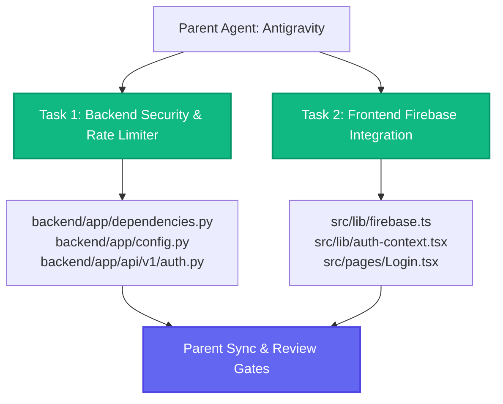

# Implementation Plan: Firebase Auth Migration & Redis Rate Limiter

This implementation plan covers migrating the **AgentForge Career OS** authentication from local JWT credentials/Clerk specs to **Firebase Authentication** (both frontend and backend) and replacing the in-memory `slowapi` rate-limiter with a robust **Redis-based sliding-window rate-limiter middleware**.

Furthermore, it outlines a **Subagent-Driven parallel execution strategy** to complete these tasks quickly and with high test coverage.

---

## User Review Required

> [!WARNING]
> **Authentication Paradigm Shift**: 
> This migration moves the responsibility of password storage, hashing, and email verification completely to **Firebase Authentication**. The backend will no longer store password hashes or issue JWTs. Instead, it will act as an **OAuth Resource Server**, validating standard RS256 Firebase ID Tokens against Google's public certificates.

> [!IMPORTANT]
> **Zero-Config Backend Verification**:
> To avoid requiring a sensitive `service-account.json` credential file in local development or environment variables, the backend will verify Firebase ID tokens by decoding them dynamically using Google's public certificates fetched from:
> `https://www.googleapis.com/robot/v1/metadata/x509/securetoken@system.gserviceaccount.com`
> This makes deployment extremely secure, lightweight, and zero-config.

---

## Open Questions

> [!NOTE]
> **Firebase Project Configuration**:
> 1. Do you have an active Firebase Project ID we should use for the local `.env` setup? (If not, we will default to `agentforge-career-os` which can be overridden via `FIREBASE_PROJECT_ID` in `.env`).
> 2. For social logins (e.g. Google OAuth), do you want to enable a "Login with Google" button on the login screen alongside email/password? (Highly recommended since Firebase makes Google OAuth trivial to add in React).

---

## Proposed Changes

### ⚙️ Backend Layer

#### [MODIFY] [config.py](file:///c:/agent-forge-care/backend/app/config.py)
*   Add `firebase_project_id: str = "agentforge-career-os"` parameter to `Settings`.
*   Keep `redis_url` and ensure it's loaded properly.

#### [MODIFY] [dependencies.py](file:///c:/agent-forge-care/backend/app/dependencies.py)
*   **Firebase Token Verification**: Refactor `get_current_user` to verify Firebase ID tokens using `python-jose`:
    *   Fetch Google's public certs dynamically.
    *   Match the key ID (`kid`) from the JWT header.
    *   Decode and verify the token audience (Firebase Project ID) and issuer (`https://securetoken.google.com/<project-id>`).
    *   Extract the user's `email`, `name`, and Firebase `sub` (UID).
*   **Auto-Provisioning (SSO)**: If a user with the decoded email does not exist in the Postgres database, automatically create a new `User` record (with empty/random password hash since auth is external) and initialize their `Profile` record (`is_onboarded=False`).
*   **Custom Redis Rate Limiter**: 
    *   Create a custom async `RedisRateLimiter` class using `redis.asyncio`.
    *   Implement a **sliding window rate-limiting algorithm** using Redis sorted sets (`ZADD`, `ZREMRANGEBYSCORE`, `ZCARD`, `EXPIRE`).
    *   Replace the local in-memory `slowapi` instance with this Redis rate limiter.

#### [MODIFY] [api/v1/auth.py](file:///c:/agent-forge-care/backend/app/api/v1/auth.py)
*   Simplify auth endpoints. Since registration and login occur directly in the React frontend via Firebase SDK, we can:
    *   Keep `/auth/me` to return the currently authenticated user's Postgres record via the updated `get_current_user` dependency.
    *   Deprecate or simplify `/auth/login` and `/auth/register` endpoints (or have them return stubs, as they are no longer required to issue tokens).

---

### 🎨 Frontend Layer

#### [MODIFY] [package.json](file:///c:/agent-forge-care/package.json)
*   Install the standard Firebase Client SDK: `npm install firebase`.

#### [NEW] [firebase.ts](file:///c:/agent-forge-care/src/lib/firebase.ts)
*   Create a Firebase initialization utility that pulls config keys from `import.meta.env` (e.g. `VITE_FIREBASE_API_KEY`, `VITE_FIREBASE_PROJECT_ID`).
*   Initialize and export `auth` from `"firebase/auth"`.
*   Provide standard fallbacks for local developer environments if keys are missing.

#### [MODIFY] [auth-context.tsx](file:///c:/agent-forge-care/src/lib/auth-context.tsx)
*   Refactor `AuthProvider` to use Firebase Auth under the hood:
    *   Listen to state changes with `onAuthStateChanged(auth, async (firebaseUser) => ... )`.
    *   On state change, fetch the ID token: `const token = await firebaseUser.getIdToken()`.
    *   Save the ID token in local storage and call `setAuthToken(token)`.
    *   Fetch the PostgreSQL user profile from `/auth/me` on the backend.
    *   Refactor `login` to call `signInWithEmailAndPassword(auth, email, password)`.
    *   Refactor `register` to call `createUserWithEmailAndPassword(auth, email, password)` and update the profile.
    *   Refactor `logout` to call `signOut(auth)`.

#### [MODIFY] [pages/Login.tsx](file:///c:/agent-forge-care/src/pages/Login.tsx) & [pages/Register.tsx](file:///c:/agent-forge-care/src/pages/Register.tsx)
*   Ensure they consume the updated `login` and `register` functions from the Auth Context.
*   Optional: Add a "Sign in with Google" button to support social logins natively via Firebase.

---

## 🤖 Parallel Subagent Execution Strategy

To execute this plan in parallel without merge conflicts, we will assign **two specialized subagents** operating on isolated parts of the codebase:

### Subagent 1: Backend Security & Rate-Limiter Agent
*   **Scope**: `backend/app/dependencies.py`, `backend/app/config.py`, `backend/app/api/v1/auth.py`
*   **Task**: Implement dynamic Firebase ID Token verification against Google's public x509 certs, implement auto-provisioning of Postgres user records on successful token verification, and build the custom async Redis sliding window rate-limiter middleware.

### Subagent 2: Frontend Firebase Integration Agent
*   **Scope**: `package.json`, `src/lib/firebase.ts`, `src/lib/auth-context.tsx`, `src/pages/Login.tsx`, `src/pages/Register.tsx`
*   **Task**: Install the Firebase SDK, initialize Firebase client-side, rewire `auth-context.tsx` to handle authentication, credentials, and tokens via Firebase Auth, and update the login/register views.

---

## Verification Plan

### Automated Tests
*   **Backend Verification Stub**: We will create a unit test suite in the backend testing the JWT decoding using mock Firebase ID tokens.
*   **Redis Rate Limiter Validation**: We will write tests to hit rate-limited endpoints repeatedly and verify that HTTP 429 Too Many Requests is returned once thresholds are crossed.
*   **Frontend Vitest Verification**: Run Vite unit tests using `npm run test` to verify no rendering regressions on the auth screens.

### Manual Verification
*   Launch the backend FastAPI app alongside Redis and Qdrant using `docker-compose up`.
*   Launch the frontend Vite dev server, perform user sign-up and sign-in, and check the PostgreSQL console to verify that the User and Profile records are automatically provisioned.
